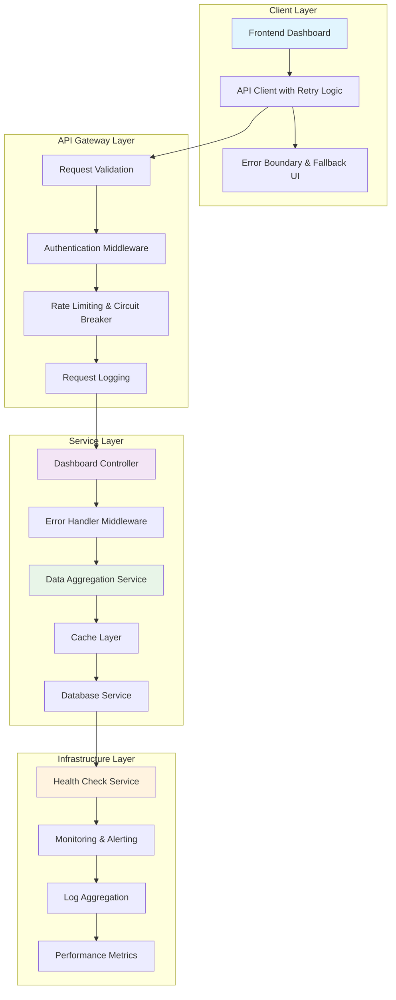

# Design Document

## Overview

The dashboard API reliability issues stem from several factors: insufficient error handling, lack of retry mechanisms, poor data validation, missing circuit breakers, and inadequate logging. This design addresses these issues through a comprehensive approach that includes robust error handling, intelligent retry logic, graceful degradation, comprehensive monitoring, and improved data processing resilience.

## Architecture



## Components and Interfaces

### Enhanced Error Handling Middleware

#### Centralized Error Handler
```python
class DashboardErrorHandler:
    """Centralized error handling for dashboard APIs."""
    
    def __init__(self):
        self.logger = logging.getLogger(__name__)
        self.error_metrics = ErrorMetrics()
    
    def handle_error(self, error: Exception, context: Dict[str, Any]) -> Dict[str, Any]:
        """Handle errors with appropriate logging and user-friendly responses."""
        error_id = str(uuid.uuid4())
        
        # Log detailed error information
        self.logger.error(f"Dashboard API Error [{error_id}]: {str(error)}", extra={
            'error_id': error_id,
            'user_id': context.get('user_id'),
            'endpoint': context.get('endpoint'),
            'request_params': context.get('params'),
            'stack_trace': traceback.format_exc()
        })
        
        # Update error metrics
        self.error_metrics.increment(
            endpoint=context.get('endpoint'),
            error_type=type(error).__name__
        )
        
        # Return appropriate error response
        if isinstance(error, AuthenticationError):
            return self._handle_auth_error(error, error_id)
        elif isinstance(error, DatabaseError):
            return self._handle_database_error(error, error_id, context)
        elif isinstance(error, ValidationError):
            return self._handle_validation_error(error, error_id)
        else:
            return self._handle_generic_error(error, error_id)
```

#### Retry Logic with Circuit Breaker
```python
class RetryableOperation:
    """Implements retry logic with exponential backoff and circuit breaker."""
    
    def __init__(self, max_retries=3, base_delay=1.0, max_delay=30.0):
        self.max_retries = max_retries
        self.base_delay = base_delay
        self.max_delay = max_delay
        self.circuit_breaker = CircuitBreaker()
    
    async def execute(self, operation: Callable, *args, **kwargs) -> Any:
        """Execute operation with retry logic."""
        if self.circuit_breaker.is_open():
            raise CircuitBreakerOpenError("Service temporarily unavailable")
        
        last_exception = None
        
        for attempt in range(self.max_retries + 1):
            try:
                result = await operation(*args, **kwargs)
                self.circuit_breaker.record_success()
                return result
                
            except (DatabaseError, NetworkError) as e:
                last_exception = e
                self.circuit_breaker.record_failure()
                
                if attempt < self.max_retries:
                    delay = min(self.base_delay * (2 ** attempt), self.max_delay)
                    await asyncio.sleep(delay)
                    continue
                else:
                    break
            except Exception as e:
                # Don't retry for non-retryable errors
                self.circuit_breaker.record_failure()
                raise e
        
        raise last_exception
```

### Enhanced Dashboard Controllers

#### Resilient Summary Controller
```python
@dashboard_bp.route('/dashboard/summary', methods=['GET'])
@require_auth
@error_handler.handle_exceptions
@performance_monitor.track_endpoint
async def get_dashboard_summary():
    """Get experiment summary with enhanced error handling and caching."""
    try:
        user_id = request.current_user['id']
        cache_key = f"dashboard_summary_{user_id}"
        
        # Try to get from cache first
        cached_data = await cache_service.get(cache_key)
        if cached_data and not request.args.get('force_refresh'):
            return jsonify({
                **cached_data,
                'cached': True,
                'cache_timestamp': cached_data.get('timestamp')
            })
        
        # Use retry logic for database operations
        retry_operation = RetryableOperation(max_retries=3)
        
        # Fetch data with fallback mechanisms
        summary_data = await retry_operation.execute(
            fetch_summary_data, user_id
        )
        
        # Cache successful results
        await cache_service.set(cache_key, summary_data, ttl=300)
        
        return jsonify(summary_data)
        
    except CircuitBreakerOpenError:
        # Return cached data if available during circuit breaker
        stale_data = await cache_service.get_stale(cache_key)
        if stale_data:
            return jsonify({
                **stale_data,
                'stale': True,
                'message': 'Service temporarily degraded, showing cached data'
            })
        
        return jsonify({
            'error': 'Dashboard service temporarily unavailable',
            'retry_after': 60,
            'fallback_data': get_minimal_summary()
        }), 503
        
    except Exception as e:
        return error_handler.handle_error(e, {
            'endpoint': '/dashboard/summary',
            'user_id': user_id,
            'params': request.args.to_dict()
        })
```

#### Robust Data Aggregation Service
```python
class DashboardDataService:
    """Service for aggregating dashboard data with error resilience."""
    
    def __init__(self):
        self.db_client = get_supabase_client()
        self.cache = CacheService()
        self.validator = DataValidator()
    
    async def fetch_summary_data(self, user_id: str) -> Dict[str, Any]:
        """Fetch summary data with partial failure handling."""
        results = {}
        errors = {}
        
        # Fetch experiments with error handling
        try:
            experiments = await self._fetch_experiments(user_id)
            results['experiments'] = experiments
            results['total_experiments'] = len(experiments)
        except Exception as e:
            errors['experiments'] = str(e)
            results['total_experiments'] = 0
            results['experiments'] = []
        
        # Fetch aggregations with fallback
        try:
            if results['experiments']:
                results['experiments_by_type'] = self._aggregate_by_type(
                    results['experiments']
                )
                results['experiments_by_status'] = self._aggregate_by_status(
                    results['experiments']
                )
            else:
                # Fallback to cached aggregations
                cached_agg = await self.cache.get(f"aggregations_{user_id}")
                if cached_agg:
                    results.update(cached_agg)
                else:
                    results['experiments_by_type'] = {}
                    results['experiments_by_status'] = {}
        except Exception as e:
            errors['aggregations'] = str(e)
            results['experiments_by_type'] = {}
            results['experiments_by_status'] = {}
        
        # Fetch recent activity with graceful degradation
        try:
            results['recent_activity'] = await self._fetch_recent_activity(
                user_id, results['experiments']
            )
        except Exception as e:
            errors['recent_activity'] = str(e)
            results['recent_activity'] = {
                'last_7_days': 0,
                'completion_rate': 0
            }
        
        # Add metadata
        results['timestamp'] = datetime.utcnow().isoformat()
        results['partial_failure'] = bool(errors)
        if errors:
            results['errors'] = errors
        
        return results
    
    async def _fetch_experiments(self, user_id: str) -> List[Dict[str, Any]]:
        """Fetch experiments with validation and error handling."""
        result = self.db_client.execute_query(
            'experiments',
            'select',
            columns='*',
            filters=[{'column': 'user_id', 'value': user_id}]
        )
        
        if not result['success']:
            raise DatabaseError(f"Failed to fetch experiments: {result['error']}")
        
        # Validate data structure
        experiments = result['data'] or []
        validated_experiments = []
        
        for exp in experiments:
            try:
                validated_exp = self.validator.validate_experiment(exp)
                validated_experiments.append(validated_exp)
            except ValidationError as e:
                logger.warning(f"Invalid experiment data: {e}")
                continue
        
        return validated_experiments
```

### Data Validation and Sanitization

#### Comprehensive Data Validator
```python
class DataValidator:
    """Validates and sanitizes dashboard data."""
    
    def validate_experiment(self, experiment: Dict[str, Any]) -> Dict[str, Any]:
        """Validate experiment data structure."""
        required_fields = ['id', 'name', 'experiment_type', 'status', 'created_at']
        
        for field in required_fields:
            if field not in experiment:
                raise ValidationError(f"Missing required field: {field}")
        
        # Sanitize and validate fields
        validated = {
            'id': self._validate_uuid(experiment['id']),
            'name': self._sanitize_string(experiment['name']),
            'experiment_type': self._validate_experiment_type(experiment['experiment_type']),
            'status': self._validate_status(experiment['status']),
            'created_at': self._validate_datetime(experiment['created_at']),
            'user_id': experiment.get('user_id'),
            'description': self._sanitize_string(experiment.get('description', '')),
            'parameters': self._validate_json(experiment.get('parameters', {}))
        }
        
        return validated
    
    def _validate_datetime(self, date_str: str) -> str:
        """Validate and normalize datetime strings."""
        try:
            # Handle different datetime formats
            if date_str.endswith('Z'):
                date_str = date_str.replace('Z', '+00:00')
            elif '+' not in date_str and 'T' in date_str:
                date_str = date_str + '+00:00'
            
            # Parse to validate
            parsed_date = datetime.fromisoformat(date_str)
            return parsed_date.isoformat()
            
        except (ValueError, TypeError) as e:
            raise ValidationError(f"Invalid datetime format: {date_str}")
```

### Caching and Performance Optimization

#### Multi-Level Cache Service
```python
class CacheService:
    """Multi-level caching with TTL and invalidation."""
    
    def __init__(self):
        self.memory_cache = {}
        self.redis_client = redis.Redis() if REDIS_AVAILABLE else None
        self.default_ttl = 300  # 5 minutes
    
    async def get(self, key: str) -> Optional[Dict[str, Any]]:
        """Get cached data with fallback levels."""
        # Try memory cache first
        if key in self.memory_cache:
            entry = self.memory_cache[key]
            if entry['expires_at'] > time.time():
                return entry['data']
            else:
                del self.memory_cache[key]
        
        # Try Redis cache
        if self.redis_client:
            try:
                cached_data = await self.redis_client.get(key)
                if cached_data:
                    data = json.loads(cached_data)
                    # Store in memory cache for faster access
                    self.memory_cache[key] = {
                        'data': data,
                        'expires_at': time.time() + 60  # 1 minute in memory
                    }
                    return data
            except Exception as e:
                logger.warning(f"Redis cache error: {e}")
        
        return None
    
    async def set(self, key: str, data: Dict[str, Any], ttl: int = None) -> None:
        """Set cached data at multiple levels."""
        ttl = ttl or self.default_ttl
        
        # Store in memory cache
        self.memory_cache[key] = {
            'data': data,
            'expires_at': time.time() + min(ttl, 300)  # Max 5 minutes in memory
        }
        
        # Store in Redis cache
        if self.redis_client:
            try:
                await self.redis_client.setex(
                    key, ttl, json.dumps(data, default=str)
                )
            except Exception as e:
                logger.warning(f"Redis cache set error: {e}")
    
    async def get_stale(self, key: str) -> Optional[Dict[str, Any]]:
        """Get stale cached data during service degradation."""
        # Check Redis for stale data (ignoring TTL)
        if self.redis_client:
            try:
                cached_data = await self.redis_client.get(f"stale_{key}")
                if cached_data:
                    return json.loads(cached_data)
            except Exception as e:
                logger.warning(f"Stale cache error: {e}")
        
        return None
```

## Error Handling

### Comprehensive Error Classification
```python
class DashboardError(Exception):
    """Base class for dashboard-specific errors."""
    pass

class AuthenticationError(DashboardError):
    """Authentication-related errors."""
    pass

class DatabaseError(DashboardError):
    """Database connectivity and query errors."""
    pass

class ValidationError(DashboardError):
    """Data validation errors."""
    pass

class CircuitBreakerOpenError(DashboardError):
    """Circuit breaker is open, service unavailable."""
    pass

class PartialDataError(DashboardError):
    """Some data could not be retrieved."""
    pass
```

### Error Response Standardization
```python
def create_error_response(error: Exception, error_id: str, context: Dict[str, Any]) -> Dict[str, Any]:
    """Create standardized error responses."""
    
    if isinstance(error, AuthenticationError):
        return {
            'error': 'Authentication failed',
            'error_code': 'AUTH_FAILED',
            'error_id': error_id,
            'message': 'Please refresh your session and try again',
            'actions': ['refresh_token', 'login_again']
        }
    
    elif isinstance(error, DatabaseError):
        return {
            'error': 'Data temporarily unavailable',
            'error_code': 'DATABASE_ERROR',
            'error_id': error_id,
            'message': 'We are experiencing technical difficulties. Please try again in a few moments.',
            'retry_after': 30,
            'fallback_available': True
        }
    
    elif isinstance(error, ValidationError):
        return {
            'error': 'Invalid data format',
            'error_code': 'VALIDATION_ERROR',
            'error_id': error_id,
            'message': 'The request contains invalid data',
            'details': str(error)
        }
    
    else:
        return {
            'error': 'Internal server error',
            'error_code': 'INTERNAL_ERROR',
            'error_id': error_id,
            'message': 'An unexpected error occurred. Our team has been notified.',
            'retry_after': 60
        }
```

## Testing Strategy

### API Reliability Testing
```python
class DashboardAPIReliabilityTests:
    """Comprehensive tests for dashboard API reliability."""
    
    def test_database_failure_handling(self):
        """Test graceful handling of database failures."""
        with patch.object(supabase_client, 'execute_query') as mock_query:
            mock_query.side_effect = DatabaseError("Connection failed")
            
            response = self.client.get('/api/dashboard/summary', headers=self.auth_headers)
            
            # Should return cached data or graceful error
            assert response.status_code in [200, 503]
            if response.status_code == 200:
                assert 'cached' in response.json or 'stale' in response.json
    
    def test_partial_data_handling(self):
        """Test handling of partial data failures."""
        with patch.object(DashboardDataService, '_fetch_recent_activity') as mock_activity:
            mock_activity.side_effect = Exception("Activity fetch failed")
            
            response = self.client.get('/api/dashboard/summary', headers=self.auth_headers)
            
            assert response.status_code == 200
            data = response.json
            assert 'partial_failure' in data
            assert data['partial_failure'] is True
            assert 'errors' in data
    
    def test_circuit_breaker_functionality(self):
        """Test circuit breaker prevents cascading failures."""
        # Simulate multiple failures to trigger circuit breaker
        for _ in range(5):
            with patch.object(supabase_client, 'execute_query') as mock_query:
                mock_query.side_effect = DatabaseError("Connection failed")
                self.client.get('/api/dashboard/summary', headers=self.auth_headers)
        
        # Next request should be blocked by circuit breaker
        response = self.client.get('/api/dashboard/summary', headers=self.auth_headers)
        assert response.status_code == 503
        assert 'temporarily unavailable' in response.json['error']
```

### Performance and Load Testing
```python
def test_dashboard_api_performance():
    """Test API performance under load."""
    import concurrent.futures
    import time
    
    def make_request():
        start_time = time.time()
        response = client.get('/api/dashboard/summary', headers=auth_headers)
        end_time = time.time()
        return response.status_code, end_time - start_time
    
    # Test concurrent requests
    with concurrent.futures.ThreadPoolExecutor(max_workers=10) as executor:
        futures = [executor.submit(make_request) for _ in range(50)]
        results = [future.result() for future in futures]
    
    # Analyze results
    response_times = [result[1] for result in results]
    success_rate = sum(1 for result in results if result[0] == 200) / len(results)
    
    assert success_rate >= 0.95  # 95% success rate
    assert max(response_times) < 10.0  # Max 10 seconds response time
    assert sum(response_times) / len(response_times) < 2.0  # Average under 2 seconds
```

## Monitoring and Alerting

### Health Check Implementation
```python
@dashboard_bp.route('/dashboard/health', methods=['GET'])
def dashboard_health_check():
    """Comprehensive health check for dashboard services."""
    health_status = {
        'service': 'dashboard',
        'status': 'healthy',
        'timestamp': datetime.utcnow().isoformat(),
        'checks': {}
    }
    
    # Database connectivity check
    try:
        result = supabase_client.execute_query('experiments', 'select', limit=1)
        health_status['checks']['database'] = {
            'status': 'healthy' if result['success'] else 'unhealthy',
            'response_time': result.get('response_time', 0)
        }
    except Exception as e:
        health_status['checks']['database'] = {
            'status': 'unhealthy',
            'error': str(e)
        }
    
    # Cache service check
    try:
        cache_service = CacheService()
        test_key = f"health_check_{int(time.time())}"
        await cache_service.set(test_key, {'test': True}, ttl=10)
        cached_data = await cache_service.get(test_key)
        
        health_status['checks']['cache'] = {
            'status': 'healthy' if cached_data else 'degraded'
        }
    except Exception as e:
        health_status['checks']['cache'] = {
            'status': 'unhealthy',
            'error': str(e)
        }
    
    # Overall status determination
    unhealthy_checks = [
        check for check in health_status['checks'].values() 
        if check['status'] == 'unhealthy'
    ]
    
    if unhealthy_checks:
        health_status['status'] = 'unhealthy'
        return jsonify(health_status), 503
    
    degraded_checks = [
        check for check in health_status['checks'].values() 
        if check['status'] == 'degraded'
    ]
    
    if degraded_checks:
        health_status['status'] = 'degraded'
    
    return jsonify(health_status)
```

## Implementation Approach

### Phase 1: Core Error Handling Infrastructure
1. Implement centralized error handler middleware
2. Add comprehensive logging and error tracking
3. Create standardized error response formats
4. Add basic retry logic for database operations

### Phase 2: Resilience and Caching
1. Implement circuit breaker pattern
2. Add multi-level caching service
3. Create data validation and sanitization
4. Add graceful degradation mechanisms

### Phase 3: Monitoring and Observability
1. Implement comprehensive health checks
2. Add performance monitoring and metrics
3. Create alerting for critical failures
4. Add dashboard for API reliability metrics

### Phase 4: Advanced Features
1. Implement intelligent retry strategies
2. Add predictive failure detection
3. Create automated recovery mechanisms
4. Add capacity planning and scaling triggers