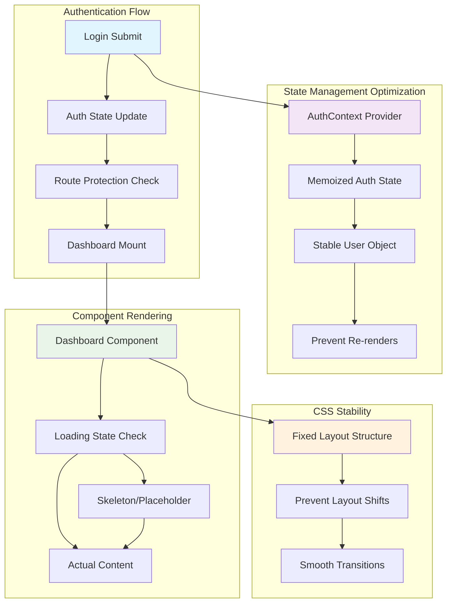

# Design Document

## Overview

The dashboard flickering issue is typically caused by multiple factors: improper authentication state management, unnecessary component re-renders, conditional rendering without proper loading states, and CSS layout shifts. This design addresses these issues through optimized state management, proper loading states, component memoization, and stable CSS layouts.

## Architecture



## Components and Interfaces

### Authentication State Management

#### Optimized AuthContext
```javascript
// Prevent unnecessary re-renders with stable user object
const AuthContext = createContext();

export const AuthProvider = ({ children }) => {
  const [user, setUser] = useState(null);
  const [loading, setLoading] = useState(true);
  const [initialized, setInitialized] = useState(false);

  // Memoize auth value to prevent re-renders
  const authValue = useMemo(() => ({
    user,
    loading,
    initialized,
    login,
    logout
  }), [user, loading, initialized]);

  return (
    <AuthContext.Provider value={authValue}>
      {children}
    </AuthContext.Provider>
  );
};
```

#### Stable Authentication Hook
```javascript
export const useAuth = () => {
  const context = useContext(AuthContext);
  
  // Return memoized values to prevent unnecessary re-renders
  return useMemo(() => context, [context.user, context.loading, context.initialized]);
};
```

### Protected Route Enhancement

#### Improved ProtectedRoute Component
```javascript
const ProtectedRoute = ({ children }) => {
  const { user, loading, initialized } = useAuth();

  // Show loading state while determining auth status
  if (!initialized || loading) {
    return <DashboardSkeleton />;
  }

  // Redirect to login if not authenticated
  if (!user) {
    return <Navigate to="/login" replace />;
  }

  // Render children without flickering
  return children;
};
```

### Dashboard Component Optimization

#### Memoized Dashboard Component
```javascript
const Dashboard = memo(() => {
  const { user } = useAuth();
  const [dashboardData, setDashboardData] = useState(null);
  const [dataLoading, setDataLoading] = useState(true);

  // Stable data fetching with proper loading states
  useEffect(() => {
    if (user) {
      fetchDashboardData();
    }
  }, [user?.id]); // Only re-run if user ID changes

  // Show skeleton while data is loading
  if (dataLoading) {
    return <DashboardSkeleton />;
  }

  return (
    <div className="dashboard-container">
      {/* Stable layout structure */}
    </div>
  );
});
```

### Loading State Components

#### Dashboard Skeleton Component
```javascript
const DashboardSkeleton = () => (
  <div className="min-h-screen bg-gray-50">
    <div className="animate-pulse">
      {/* Header skeleton */}
      <div className="h-16 bg-white border-b border-gray-200">
        <div className="h-4 bg-gray-300 rounded w-32 mt-6 ml-6"></div>
      </div>
      
      {/* Content skeleton */}
      <div className="p-6 space-y-6">
        <div className="grid grid-cols-1 md:grid-cols-3 gap-6">
          {[1, 2, 3].map(i => (
            <div key={i} className="h-32 bg-white rounded-lg shadow">
              <div className="p-4 space-y-3">
                <div className="h-4 bg-gray-300 rounded w-3/4"></div>
                <div className="h-8 bg-gray-300 rounded w-1/2"></div>
              </div>
            </div>
          ))}
        </div>
      </div>
    </div>
  </div>
);
```

## Data Models

### Authentication State Interface
```typescript
interface AuthState {
  user: User | null;
  loading: boolean;
  initialized: boolean;
  error: string | null;
}

interface User {
  id: string;
  email: string;
  created_at: string;
}
```

### Component State Management
```typescript
interface DashboardState {
  data: DashboardData | null;
  loading: boolean;
  error: string | null;
  lastFetch: number;
}

interface LoadingStates {
  auth: boolean;
  dashboard: boolean;
  experiments: boolean;
}
```

## Error Handling

### Authentication Error Handling
- Graceful handling of authentication failures without visual disruption
- Proper error boundaries to catch and handle rendering errors
- Fallback UI states for when authentication is unavailable

### Component Error Handling
```javascript
class DashboardErrorBoundary extends Component {
  constructor(props) {
    super(props);
    this.state = { hasError: false };
  }

  static getDerivedStateFromError(error) {
    return { hasError: true };
  }

  componentDidCatch(error, errorInfo) {
    console.error('Dashboard error:', error, errorInfo);
  }

  render() {
    if (this.state.hasError) {
      return <DashboardErrorFallback />;
    }

    return this.props.children;
  }
}
```

## Testing Strategy

### Visual Regression Testing
- Automated screenshots during login-to-dashboard transition
- Comparison testing to detect flickering or layout shifts
- Performance testing for component render times

### Unit Testing
```javascript
describe('Dashboard Flickering Prevention', () => {
  test('should not re-render unnecessarily on auth state change', () => {
    const renderSpy = jest.fn();
    // Test implementation
  });

  test('should show stable loading state during transition', () => {
    // Test implementation
  });

  test('should prevent layout shifts during content loading', () => {
    // Test implementation
  });
});
```

### Integration Testing
- End-to-end tests for complete login-to-dashboard flow
- Performance monitoring for render cycles
- User experience testing for smooth transitions

## Performance Optimization

### React Optimization Techniques

#### Memoization Strategy
```javascript
// Memoize expensive computations
const memoizedDashboardData = useMemo(() => {
  return processDashboardData(rawData);
}, [rawData]);

// Memoize callback functions
const handleExperimentClick = useCallback((experimentId) => {
  // Handle click
}, []);

// Memoize component props
const MemoizedExperimentCard = memo(ExperimentCard, (prevProps, nextProps) => {
  return prevProps.experiment.id === nextProps.experiment.id &&
         prevProps.experiment.updated_at === nextProps.experiment.updated_at;
});
```

#### State Update Optimization
```javascript
// Batch state updates to prevent multiple re-renders
const updateDashboardState = useCallback((newData) => {
  setDashboardState(prevState => ({
    ...prevState,
    data: newData,
    loading: false,
    lastFetch: Date.now()
  }));
}, []);
```

### CSS Performance

#### Stable Layout Classes
```css
/* Prevent layout shifts with fixed dimensions */
.dashboard-container {
  min-height: 100vh;
  display: grid;
  grid-template-rows: auto 1fr;
}

.dashboard-content {
  /* Stable grid layout */
  display: grid;
  grid-template-columns: repeat(auto-fit, minmax(300px, 1fr));
  gap: 1.5rem;
  padding: 1.5rem;
}

/* Smooth transitions */
.fade-in {
  animation: fadeIn 0.2s ease-in-out;
}

@keyframes fadeIn {
  from { opacity: 0; }
  to { opacity: 1; }
}
```

#### Loading State Styling
```css
/* Skeleton loading animations */
.skeleton {
  background: linear-gradient(90deg, #f0f0f0 25%, #e0e0e0 50%, #f0f0f0 75%);
  background-size: 200% 100%;
  animation: loading 1.5s infinite;
}

@keyframes loading {
  0% { background-position: 200% 0; }
  100% { background-position: -200% 0; }
}
```

## Implementation Approach

### Phase 1: Authentication State Optimization
1. Implement memoized AuthContext with stable user object
2. Add proper initialization state management
3. Create optimized useAuth hook with memoization

### Phase 2: Component Rendering Optimization
1. Add React.memo to Dashboard and related components
2. Implement proper loading states with skeleton components
3. Add error boundaries for graceful error handling

### Phase 3: CSS and Layout Stability
1. Implement stable CSS grid layouts
2. Add smooth transition animations
3. Prevent layout shifts with fixed dimensions

### Phase 4: Performance Monitoring
1. Add performance monitoring for render cycles
2. Implement visual regression testing
3. Monitor and optimize bundle size impact