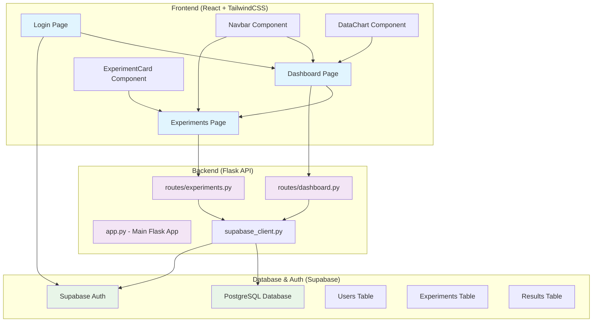

# Design Document

## Overview

NeuroLab 360 is architected as a modern full-stack web application with clear separation of concerns. The system follows a three-tier architecture with a React frontend, Flask API backend, and Supabase as the database and authentication provider. The design emphasizes modularity, scalability, and maintainability while providing an intuitive user experience for researchers conducting neurological experiments.

## Architecture



## Components and Interfaces

### Frontend Components

#### Pages
- **Login.jsx**: Handles user authentication with form validation and Supabase Auth integration
- **Dashboard.jsx**: Main dashboard displaying experiment summaries and data visualizations
- **Experiments.jsx**: Interface for creating, configuring, and running mock experiments

#### Reusable Components
- **Navbar.jsx**: Navigation component with user session management and routing
- **ExperimentCard.jsx**: Card component displaying individual experiment information
- **DataChart.jsx**: Chart component using a charting library (Chart.js or Recharts) for data visualization

#### Frontend Architecture Patterns
- React functional components with hooks for state management
- Context API for global state (user authentication, theme)
- Custom hooks for API calls and data fetching
- Component composition for reusability
- Responsive design using TailwindCSS utility classes

### Backend API Structure

#### Flask Application (app.py)
```python
# Main Flask application with CORS configuration
# Route registration and error handling
# Environment configuration loading
```

#### API Routes

**experiments.py**
- `POST /api/experiments` - Create and run a new experiment
- `GET /api/experiments` - Retrieve user's experiment history
- `GET /api/experiments/<id>` - Get specific experiment details
- `DELETE /api/experiments/<id>` - Delete an experiment

**dashboard.py**
- `GET /api/dashboard/summary` - Get experiment summary statistics
- `GET /api/dashboard/charts` - Get data formatted for charts
- `GET /api/dashboard/recent` - Get recent experiment results

#### Supabase Integration (supabase_client.py)
```python
# Supabase client initialization
# Authentication helpers
# Database query utilities
# Error handling for Supabase operations
```

## Data Models

### Database Schema

#### Users Table (Managed by Supabase Auth)
```sql
-- Automatically managed by Supabase Auth
-- Contains: id, email, created_at, updated_at
```

#### Experiments Table
```sql
CREATE TABLE experiments (
    id UUID PRIMARY KEY DEFAULT gen_random_uuid(),
    user_id UUID REFERENCES auth.users(id) ON DELETE CASCADE,
    name VARCHAR(255) NOT NULL,
    experiment_type VARCHAR(100) NOT NULL,
    parameters JSONB,
    status VARCHAR(50) DEFAULT 'pending',
    created_at TIMESTAMP WITH TIME ZONE DEFAULT NOW(),
    updated_at TIMESTAMP WITH TIME ZONE DEFAULT NOW()
);
```

#### Results Table
```sql
CREATE TABLE results (
    id UUID PRIMARY KEY DEFAULT gen_random_uuid(),
    experiment_id UUID REFERENCES experiments(id) ON DELETE CASCADE,
    data_points JSONB NOT NULL,
    metrics JSONB,
    analysis_summary TEXT,
    created_at TIMESTAMP WITH TIME ZONE DEFAULT NOW()
);
```

#### Row Level Security (RLS) Policies
```sql
-- Users can only access their own experiments and results
ALTER TABLE experiments ENABLE ROW LEVEL SECURITY;
ALTER TABLE results ENABLE ROW LEVEL SECURITY;

CREATE POLICY "Users can view own experiments" ON experiments
    FOR SELECT USING (auth.uid() = user_id);

CREATE POLICY "Users can insert own experiments" ON experiments
    FOR INSERT WITH CHECK (auth.uid() = user_id);
```

### Frontend Data Models

#### TypeScript Interfaces
```typescript
interface User {
  id: string;
  email: string;
  created_at: string;
}

interface Experiment {
  id: string;
  user_id: string;
  name: string;
  experiment_type: string;
  parameters: Record<string, any>;
  status: 'pending' | 'running' | 'completed' | 'failed';
  created_at: string;
  updated_at: string;
}

interface ExperimentResult {
  id: string;
  experiment_id: string;
  data_points: Array<{
    timestamp: number;
    value: number;
    metadata?: Record<string, any>;
  }>;
  metrics: {
    mean: number;
    std_dev: number;
    min: number;
    max: number;
  };
  analysis_summary: string;
  created_at: string;
}
```

## Error Handling

### Frontend Error Handling
- Global error boundary component for React error catching
- Toast notifications for user-friendly error messages
- Form validation with real-time feedback
- Network error handling with retry mechanisms
- Loading states and skeleton components during data fetching

### Backend Error Handling
```python
# Custom exception classes for different error types
class NeuroLabException(Exception):
    pass

class ExperimentError(NeuroLabException):
    pass

class DatabaseError(NeuroLabException):
    pass

# Global error handler in Flask
@app.errorhandler(Exception)
def handle_error(error):
    # Log error details
    # Return appropriate HTTP status and message
    # Sanitize error messages for security
```

### Database Error Handling
- Connection retry logic for Supabase client
- Transaction rollback for failed operations
- Graceful degradation when database is unavailable
- Data validation before database operations

## Testing Strategy

### Frontend Testing
- **Unit Tests**: Jest and React Testing Library for component testing
- **Integration Tests**: Testing component interactions and API calls
- **E2E Tests**: Cypress for full user workflow testing
- **Visual Regression Tests**: Screenshot comparison for UI consistency

### Backend Testing
- **Unit Tests**: pytest for individual function testing
- **Integration Tests**: Testing API endpoints with test database
- **Mock Testing**: Mocking Supabase client for isolated testing
- **Load Testing**: Testing API performance under load

### Database Testing
- **Schema Tests**: Validating database schema and constraints
- **Migration Tests**: Testing database migration scripts
- **Performance Tests**: Query optimization and indexing validation
- **Security Tests**: Testing RLS policies and access controls

## Security Considerations

### Authentication & Authorization
- Supabase Auth handles secure authentication with JWT tokens
- Row Level Security (RLS) policies enforce data access controls
- API endpoints validate user authentication before processing requests
- Session management with secure token storage

### Data Protection
- Environment variables for sensitive configuration
- HTTPS enforcement for all communications
- Input validation and sanitization on all user inputs
- SQL injection prevention through parameterized queries

### Frontend Security
- Content Security Policy (CSP) headers
- XSS protection through React's built-in escaping
- Secure token storage using httpOnly cookies or secure localStorage
- CORS configuration to restrict API access

## Performance Optimization

### Frontend Performance
- Code splitting and lazy loading for route-based components
- Memoization of expensive computations using React.memo and useMemo
- Optimized bundle size through tree shaking and minification
- Image optimization and lazy loading for charts and visualizations

### Backend Performance
- Database connection pooling for efficient resource usage
- Caching strategies for frequently accessed data
- Pagination for large dataset queries
- Background job processing for long-running experiments

### Database Performance
- Proper indexing on frequently queried columns
- Query optimization and explain plan analysis
- Connection pooling and prepared statements
- Data archiving strategies for historical experiment data